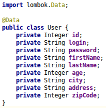
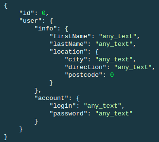
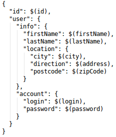
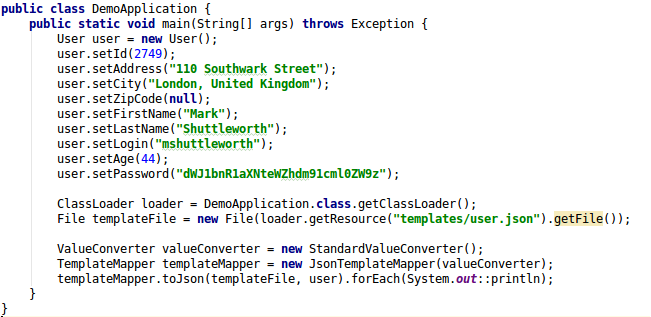
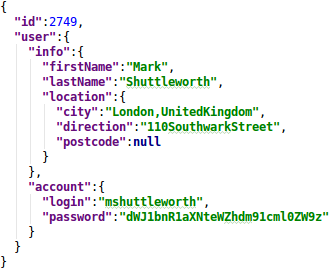
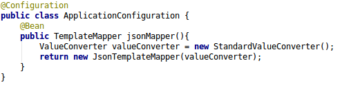
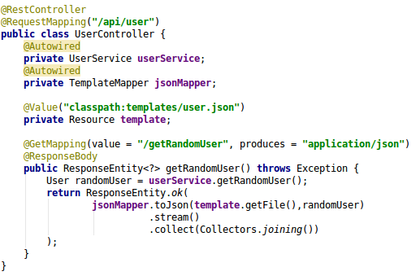

# JsonTemplateMapper

**JsonTemplateMapper** - Lib for simple mapping POJO to json through json template

### Example
Simple POJO 
  
It is necessary to obtain JSON from **User** entity of the following form
  
JsonTemplateMapper create json data through preformed json template. For example, let's create a template(**user.json**) adapted for **User** entity:
  
In $(...) expression put target POJO class members names. The following example shows the completion of the json template:
  
Result output:
  

### Integration with Spring framework

Create TemplateMapper bean:
  
Use mapper in rest controller:

    